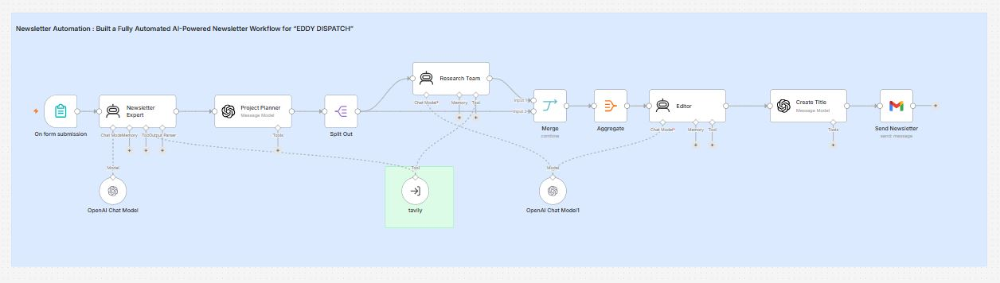
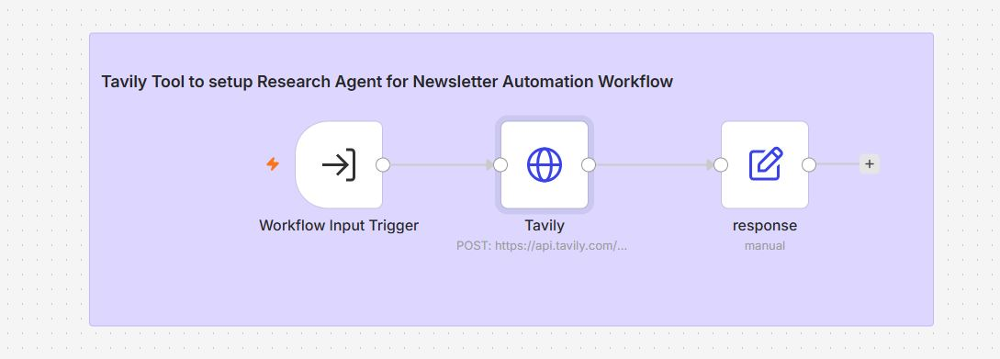

# 📬 Team of Research Agents for Newsletter Automation using n8n


---

# 📖 Overview

This project demonstrates a **multi-agent AI newsletter automation system** built entirely in **n8n**.

Instead of relying on a single LLM prompt, the workflow distributes responsibilities across multiple specialized AI agents. Each agent focuses on a single task, producing higher-quality and more structured newsletter content.

The workflow automatically researches a given topic using **Tavily Search**, plans the newsletter structure, assigns research tasks, combines findings, edits the final article, generates an engaging title, and sends the completed newsletter through Gmail.

The project consists of **two interconnected workflows**:

* **Main Workflow** – Newsletter Automation
* **Sub Workflow** – Tavily Research Tool

Together, these workflows create a scalable AI-powered newsletter generation pipeline suitable for businesses, content teams, startups, and research organizations.

---

# 🖼️ Workflow Layouts





---

# ✨ Features

* 🤖 Multi-Agent AI Architecture
* 📑 AI Newsletter Planning
* 🌐 Real-time Web Research using Tavily
* 🧩 Parallel Research Task Execution
* 🔄 Automatic Result Aggregation
* ✍️ AI Editing and Content Improvement
* 📰 AI Newsletter Title Generation
* 📧 Gmail Newsletter Delivery
* ⚡ Modular Sub-workflow Architecture
* 🛠 Easy to Customize

---

# 🎯 Use Cases

## 📰 Newsletter Automation

Automatically create weekly or daily newsletters from current web information.

---

## 🏢 Business Research

Generate internal market intelligence newsletters for organizations.

---

## 💹 Industry Updates

Create newsletters focused on finance, AI, cybersecurity, healthcare, technology, or any niche topic.

---

## 📈 Marketing Teams

Generate content for email campaigns with minimal manual work.

---

## 🎓 Educational Institutes

Prepare research summaries and educational newsletters.

---

## 🧠 AI Research Teams

Collect and summarize multiple research sources automatically.

---

## 🌍 Knowledge Management

Maintain internal knowledge bases with AI-generated research digests.

---

# 🤖 AI Agents Used

This workflow uses multiple specialized AI agents instead of one large prompt.

---

## 🧠 Newsletter Expert

### Purpose

Receives the user request submitted from the form.

Understands:

* Topic
* Audience
* Newsletter goal
* Writing style
* Research depth

Produces a structured request for the Project Planner.

---

## 📋 Project Planner

### Purpose

Acts as the project manager.

Instead of generating content directly, it divides the request into multiple research tasks.

Example:

```
Research Task 1
Latest AI News

Research Task 2
Major Company Announcements

Research Task 3
Industry Trends

Research Task 4
Emerging Startups
```

This enables parallel AI research.

---

## 🔍 Research Team

### Purpose

Processes every research task independently.

Each task is sent to the **Tavily Tool Workflow** for live web search.

Responsibilities include:

* Searching reliable sources
* Filtering irrelevant information
* Summarizing findings
* Returning structured research

---

## ✍️ Editor Agent

### Purpose

Receives all research summaries.

The Editor:

* Removes duplicate information
* Organizes sections
* Improves readability
* Creates smooth transitions
* Produces a professional newsletter

---

## 📰 Title Generator

### Purpose

Generates an attractive newsletter title based on the completed content.

Examples:

* AI Weekly Digest
* Future of Artificial Intelligence
* Cybersecurity Weekly Report

---

# 🔄 Main Workflow Nodes

---

# 1️⃣ Form Trigger

📌 **Node Type**

Form Trigger

### 🎯 Purpose

Starts the workflow whenever a user submits a newsletter request.

---

### Expected Input

* Newsletter Topic
* Target Audience
* Tone
* Research Depth
* Additional Instructions

---

### Example

```
Topic:
Artificial Intelligence

Audience:
Software Engineers

Tone:
Professional

Research Depth:
Detailed
```

---

# 2️⃣ Newsletter Expert

📌 **Node Type**

AI Agent

### Purpose

Interprets the form submission.

Creates a structured request for the Project Planner.

---

### Uses

* OpenAI Chat Model
* Chat Memory
* Tool Output Parser

---

### Output

```json
{
  "topic":"Artificial Intelligence",
  "audience":"Software Engineers",
  "depth":"Detailed"
}
```

---

# 3️⃣ Project Planner

📌 **Node Type**

OpenAI Message Model

### Purpose

Breaks one large request into multiple independent research tasks.

---

### Example Output

```json
[
{
"title":"Latest AI News"
},
{
"title":"OpenAI Updates"
},
{
"title":"Enterprise AI"
},
{
"title":"Future Trends"
}
]
```

---

# 4️⃣ Split Out

📌 **Node Type**

Split Out

### Purpose

Creates one execution branch for each research task.

Instead of one large prompt, each topic becomes an independent research request.

Benefits include:

* Faster execution
* Better research quality
* Easier scaling
* Parallel processing

---

# 5️⃣ Research Team Agent

📌 **Node Type**

AI Agent

### Purpose

Acts as the dedicated research department.

For every research topic it:

* Calls Tavily Tool
* Reads search results
* Removes irrelevant data
* Summarizes information
* Returns structured findings

---

### Connected Components

* OpenAI Chat Model
* Memory
* Tavily Tool

---

# 6️⃣ Merge

📌 **Node Type**

Merge

### Purpose

Waits until every research task is complete.

Combines all parallel execution branches into one dataset.

---

# 7️⃣ Aggregate

📌 **Node Type**

Aggregate

### Purpose

Collects all summaries into one structured object for the Editor Agent.

---

### Example

```json
[
{
"title":"AI News",
"summary":"..."
},
{
"title":"Enterprise AI",
"summary":"..."
}
]
```

---

# 8️⃣ Editor Agent

📌 **Node Type**

AI Agent

### Purpose

Produces the final newsletter.

Responsibilities:

* Rewrite
* Improve grammar
* Remove repetition
* Add logical flow
* Improve readability
* Create professional formatting

---

# 9️⃣ Create Title

📌 **Node Type**

OpenAI Message Model

### Purpose

Generates an engaging title based on the completed newsletter.

Example:

```
AI Weekly Insights:
Major Developments You Shouldn't Miss
```

---

# 🔟 Gmail

📌 **Node Type**

Gmail

### Purpose

Sends the completed newsletter to recipients.

### Configuration

| Parameter | Value                |
| --------- | -------------------- |
| Resource  | Message              |
| Operation | Send                 |
| Format    | HTML                 |
| Subject   | AI Generated Title   |
| Body      | Generated Newsletter |

---

# 🌐 Sub Workflow – Tavily Research Tool

The **Tavily Research Tool** is a reusable sub-workflow that performs live web searches. Instead of embedding HTTP requests directly into the main workflow, the Research Team agent calls this workflow as a tool whenever external information is needed.

This modular design improves maintainability, allows the search component to be reused across projects, and keeps the main workflow focused on orchestration rather than API implementation.

---

# 🔄 Tavily Sub Workflow Nodes

---

# 1️⃣ Workflow Input Trigger

📌 **Node Type**

Workflow Trigger

### 🎯 Purpose

Receives research requests from the Main Newsletter Automation workflow.

The input contains the search topic generated by the Project Planner.

---

### Example Input

```json
{
  "query": "Latest Artificial Intelligence News July 2026"
}
```

---

### Configuration

| Parameter | Value            |
| --------- | ---------------- |
| Trigger   | Execute Workflow |
| Input     | JSON             |
| Output    | Search Results   |

---

# 2️⃣ HTTP Request (Tavily)

📌 **Node Type**

HTTP Request

### 🎯 Purpose

Sends a POST request to the Tavily Search API to retrieve live web information.

---

### Method

```
POST
```

---

### Endpoint

```
https://api.tavily.com/search
```

---

### Headers

| Header        | Value                      |
| ------------- | -------------------------- |
| Content-Type  | application/json           |
| Authorization | Bearer YOUR_TAVILY_API_KEY |

---

### Request Body

```json
{
  "query":"Latest Artificial Intelligence News",
  "search_depth":"advanced",
  "include_answer":true,
  "max_results":5
}
```

---

### Important Parameters

| Parameter       | Description          |
| --------------- | -------------------- |
| query           | Search topic         |
| search_depth    | basic / advanced     |
| include_answer  | AI generated summary |
| max_results     | Number of sources    |
| include_images  | Optional             |
| include_domains | Optional             |
| exclude_domains | Optional             |

---

### Example Response

```json
{
  "answer":"OpenAI announced several new AI models...",
  "results":[
    {
      "title":"OpenAI News",
      "url":"https://example.com/openai",
      "content":"..."
    },
    {
      "title":"Google AI",
      "url":"https://example.com/google",
      "content":"..."
    }
  ]
}
```

---

# 3️⃣ Response Node

📌 **Node Type**

Set / Response

### 🎯 Purpose

Formats Tavily's API response into a clean JSON object before returning it to the Main Workflow.

---

### Output Example

```json
{
  "summary":"Latest AI developments...",
  "sources":[
    "...",
    "...",
    "..."
  ]
}
```

---

# 🔐 Required Credentials

## 🤖 OpenAI

Required For

* Newsletter Expert
* Project Planner
* Research Team
* Editor
* Title Generator

Credential

```
OpenAI API Key
```

---

## 🌐 Tavily

Required For

Live Web Search

Credential

```
TAVILY_API_KEY
```

---

## 📧 Gmail

Required For

Sending newsletters

Credential

```
Google OAuth2 Credential
```

Permissions

* Gmail Send
* Gmail Read (optional)

---

# ⚙️ Installation

## Step 1

Import **newsletter-automation.json** into n8n.

---

## Step 2

Import **tavily-research-tool.json** into n8n.

---

## Step 3

Create an OpenAI credential.

---

## Step 4

Add your OpenAI API key.

---

## Step 5

Create a Tavily API credential or configure the HTTP Request node with your API key.

---

## Step 6

Configure Gmail OAuth2 credentials.

---

## Step 7

Reconnect the Research Team tool to the imported Tavily sub-workflow if required.

---

## Step 8

Update recipient email addresses in the Gmail node.

---

## Step 9

Run the Tavily workflow independently to verify search results.

---

## Step 10

Run the Main Newsletter workflow and enable both workflows.

---

## Industry Highlights

Enterprise adoption of AI continues to accelerate across healthcare and finance sectors.

---

## Emerging Trends

- AI Agents
- Retrieval Augmented Generation
- Multimodal Applications

---

Thank you for reading this week's AI Newsletter.
```

---

# 🎨 Customization Ideas

* 🌍 Multi-language newsletters
* 📅 Scheduled daily or weekly dispatch
* 📱 Telegram or Slack delivery
* 📰 Multiple newsletter templates
* 📊 Analytics and open-rate tracking
* 🗂️ Save newsletters to Google Drive or Notion
* 🔍 Add additional research providers besides Tavily
* 🤖 Human approval step before sending

---

# 🛠️ Troubleshooting

| Problem                           | Cause                           | Solution                                              |
| --------------------------------- | ------------------------------- | ----------------------------------------------------- |
| No search results                 | Invalid Tavily API key          | Verify API key and HTTP headers                       |
| Gmail send failed                 | OAuth expired                   | Reconnect Gmail credentials                           |
| Empty newsletter                  | Research agent returned no data | Verify Tavily workflow execution                      |
| Workflow cannot call sub-workflow | Incorrect workflow reference    | Re-link the Tool node to the imported Tavily workflow |
| Duplicate sections                | Overlapping research tasks      | Refine Project Planner prompt                         |
| Slow execution                    | Too many research tasks         | Reduce parallel tasks or max search results           |

---

# 💻 Technologies Used

* n8n
* OpenAI GPT-4o / GPT-4o Mini
* Tavily Search API
* Gmail API
* HTTP Request
* AI Agents
* JavaScript
* JSON

---

# 🚀 Future Improvements

* 📈 AI-generated newsletter analytics
* 🧠 Memory-enabled long-term research agents
* 📰 RSS feed integration
* 🗄️ Knowledge base using vector databases
* 🌍 Multi-language newsletter generation
* 👨‍💼 Human approval workflow before sending
* ☁️ Notion, Google Docs, or Confluence export
* 📢 Automatic posting to LinkedIn, Medium, or WordPress

---

# 🤝 Contributing

Contributions are welcome! Feel free to fork this repository, open issues, and submit pull requests to improve the workflows, prompts, or integrations.

---

# ⭐ Support

If this workflow helped you build AI-powered newsletter automation, consider giving the repository a **⭐ Star** on GitHub. It helps others discover the project and supports continued development.
